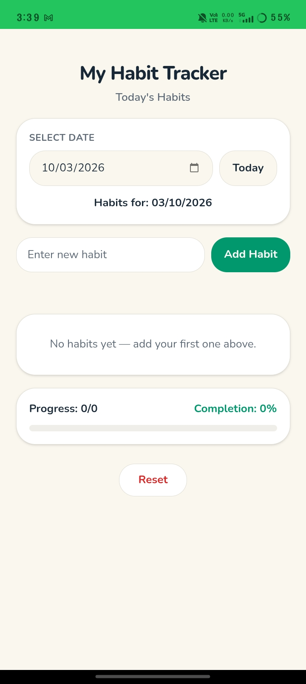
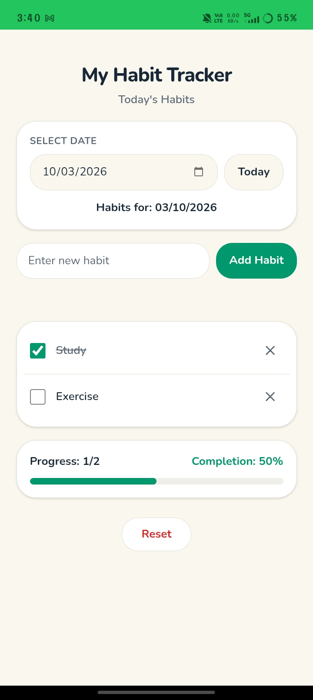
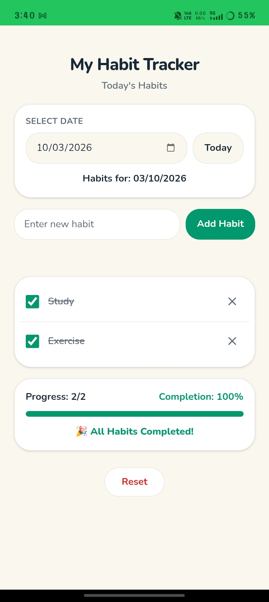

# 📱 Habit Tracker

A simple mobile application for creating and tracking daily habits.

## 🛠️ Developed Using

- MIT App Inventor
- Android

## ✨ Features

- ➕ Create habits
- 🗑️ Delete habits
- 📅 Track daily habits
- 📊 View habit progress
- ✅ Mark habits as completed
- 📈 Calculate completion percentage
  ## 📸 Screenshots

### Home Screen

### Habit Tracking

### Progress

## 🎯 Purpose

The Habit Tracker helps users build consistent daily habits and monitor their progress easily.

## 👩‍💻 Developer

Sivaranjani V 
B.E. CSE (AI & ML) Student  
Government College of Technology, Coimbatore

## 📌 Project Status

Completed ✅
## 💡 Technologies Used

- MIT App Inventor
- Android
- Visual Blocks
- Local Data Storage

## 📚 What I Learned

- Designing a simple mobile application
- Working with visual programming blocks
- Managing habit data
- Tracking completion progress
- Building and testing an Android application

